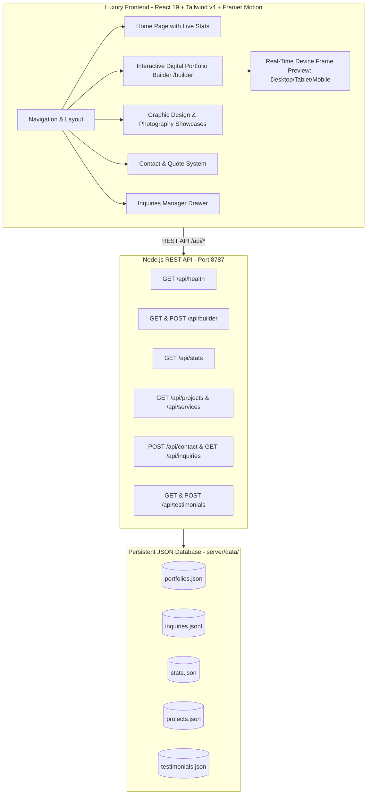

# Full-Stack Digital Portfolio Builder & Luxury Studio Walkthrough

We have successfully engineered and verified the complete full-stack web application combining a **Node.js REST API backend**, a **luxury UI/UX frontend**, and an **interactive Digital Portfolio Builder tool**.

---

## 1. Architecture Overview

---

## 2. What Was Built & Accomplished

### A. Full REST Backend (`server/index.js` & `server/data/`)
1. **Portfolio Builder Engine**:
   - `POST /api/builder`: Accepts custom portfolio configuration (persona, bio, theme, layout, projects, contacts) and persists it with unique ID (`pf-...`).
   - `GET /api/builder`: Lists all user-created portfolios.
   - `GET /api/builder/:id`: Retrieves a specific user portfolio.
2. **Studio Operations & Inquiries**:
   - `POST /api/contact`: Validates and saves inbound project quote inquiries with timestamps and status tags.
   - `GET /api/inquiries`: Live query of all inbound inquiries for the studio manager drawer.
3. **Dynamic Studio APIs**:
   - `GET /api/health`: Health monitoring and uptime metrics.
   - `GET /api/stats`: Real-time studio performance counters (satisfaction rate, awards, projects completed).
   - `GET /api/projects`: Curated portfolio projects with category filtering.
   - `GET /api/services`: Studio offerings, starting prices, deliverables, and timelines.
   - `GET & POST /api/testimonials`: Verified reviews and review submissions.

### B. Interactive Digital Portfolio Builder (`/builder`)
- **Visual Creator Persona**: Edit Name, Title, Bio, Location, Email, and Social Handles.
- **Theme Architecture**: Choose between 4 curated luxury themes:
  - *Obsidian & Gold* (`#0d0c09` / `#c8a54a`)
  - *Warm Editorial* (`#faf8f4` / `#b08530`)
  - *Nordic Minimal* (`#0a0a0c` / `#ffffff`)
  - *Emerald Noir* (`#07120e` / `#3dd68c`)
- **Layout Modes**: Masonry Grid, Editorial Storyboard, Minimal Modern, and Split Showcase.
- **Project Manager**: Add, edit, and delete custom project cards with instant image previews or 1-click curated studio visuals.
- **Real-Time Responsive Device Viewport**: Switch between **Desktop**, **Tablet (768px)**, and **Mobile (390px)** frames to see exactly how your portfolio looks across devices.
- **Cloud Save & Export**:
  - **Save & Publish** button sends the state directly to the REST backend.
  - **Export JSON** downloads the complete portfolio configuration file.
  - **Reset Sample** button resets to a pre-filled luxury demo.

### C. Studio Inquiries Live Drawer (`src/app/components/InquiriesDrawer.tsx`)
- Discreet **"Studio Inquiries"** trigger in the header and footer.
- Real-time slide-out drawer reading directly from `/api/inquiries`.
- Inbound inquiries display client name, email, WhatsApp quick link, interest tier, timeline, and message content.

### D. Luxury Frontend UI/UX Design System
- **Design Tokens (`src/tokens.ts`)**: Editorial Obsidian `#0d0c09`, Warm Sand `#faf8f4`, Artisanal Gold `#c8a54a`, and glassmorphic elevated panels.
- **Interactive Home Page**: Connected live to `/api/stats` and featuring a dedicated **Digital Portfolio Builder** studio showcase section with call-to-actions.
- **Toast Notifications (`src/app/components/Toast.tsx`)**: Non-intrusive floating feedback when items are saved, copied, or submitted.

---

## 3. Verification & Validation Results

### Backend API Testing
All endpoints were tested and verified against the running server at `http://127.0.0.1:8787`:
- `GET /api/health` -> `HTTP 200` (`{"ok":true,"service":"idesign-api","version":"2.0.0"}`)
- `GET /api/stats` -> `HTTP 200` (`{"projectsCompleted":184,"clientSatisfaction":"99.4%"}`)
- `POST /api/builder` -> `HTTP 201` (`"Digital portfolio created successfully"`)
- `GET /api/builder/:id` -> `HTTP 200` (Retrieved saved portfolio)
- `POST /api/contact` -> `HTTP 201` (`"Inquiry received successfully"`)
- `GET /api/inquiries` -> `HTTP 200` (Returned inquiries list with newly submitted item)

### Frontend Production Build
- Executed `npm.cmd run build`:
  - Transformed 496 modules.
  - Bundled `PortfolioBuilder`, `Home`, `GraphicDesign`, `Photography`, `CreativeConcepts`, and `Contact`.
  - **Build status: SUCCESS (0 errors, 0 warnings, completed in 2.14s)**.
