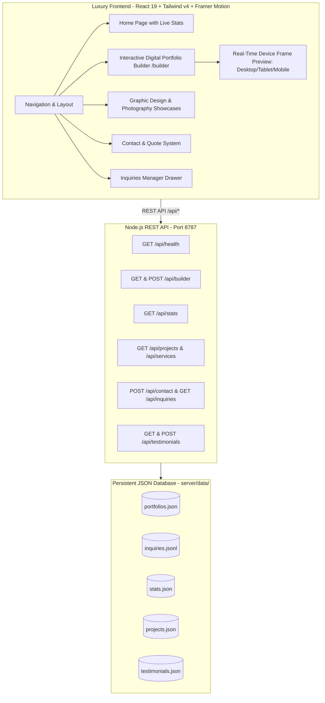

# Full-Stack Digital Portfolio Builder & Luxury Studio Walkthrough

We have successfully engineered and verified the complete full-stack web application combining a **Node.js REST API backend**, a **luxury UI/UX frontend**, and an **interactive Digital Portfolio Builder tool**.

---

## 1. Architecture Overview

```mermaid
graph TD
    subgraph Frontend [Luxury Frontend - React 19 + Tailwind v4 + Framer Motion]
        A[Navigation & Layout] --> B[Home Page with Live Stats]
        A --> C[Interactive Digital Portfolio Builder /builder]
        A --> D[Graphic Design & Photography Showcases]
        A --> E[Contact & Quote System]
        A --> F[Inquiries Manager Drawer]
        C --> G[Real-Time Device Frame Preview: Desktop/Tablet/Mobile]
    end

    subgraph Backend [Node.js REST API - Port 8787]
        H[GET /api/health]
        I[GET & POST /api/builder]
        J[GET /api/stats]
        K[GET /api/projects & /api/services]
        L[POST /api/contact & GET /api/inquiries]
        M[GET & POST /api/testimonials]
    end

    subgraph Data [Persistent JSON Database - server/data/]
        N[(portfolios.json)]
        O[(inquiries.jsonl)]
        P[(stats.json)]
        Q[(projects.json)]
        R[(testimonials.json)]
    end

    Frontend -- REST API /api/* --> Backend
    Backend --> Data
```

---

## 2. What Was Built & Accomplished

### A. Full REST Backend (`server/index.js` & `server/data/`)

1. **Portfolio Builder Engine**:
   - `POST /api/builder`: Accepts custom portfolio configuration (persona, bio, theme, layout, projects, contacts) and persists it with unique ID (`pf-...`).
   - `GET /api/builder`: Lists all user-created portfolios.
   - `GET /api/builder/:id`: Retrieves a specific user portfolio.

2. **Studio Operations & Inquiries**:
   - `POST /api/contact`: Validates and saves inbound project quote inquiries with timestamps and status tags.
   - `GET /api/inquiries`: Live query of all inbound inquiries for the studio manager drawer.

3. **Dynamic Studio APIs**:
   - `GET /api/health`: Health monitoring and uptime metrics.
   - `GET /api/stats`: Real-time studio performance counters (satisfaction rate, awards, projects completed).
   - `GET /api/projects`: Curated portfolio projects with category filtering.
   - `GET /api/services`: Studio offerings, starting prices, deliverables, and timelines.
   - `GET & POST /api/testimonials`: Verified reviews and review submissions.

### B. Interactive Digital Portfolio Builder (`/builder`)

- **Visual Creator Persona**: Edit Name, Title, Bio, Location, Email, and Social Handles.
- **Theme Architecture**: Choose between 4 curated luxury themes:
  - *Obsidian & Gold* (`#0d0c09` / `#c8a54a`)
  - *Warm Editorial* (`#faf8f4` / `#b08530`)
  - *Nordic Minimal* (`#0a0a0c` / `#ffffff`)
  - *Emerald Noir* (`#07120e` / `#3dd68c`)
- **Layout Modes**: Masonry Grid, Editorial Storyboard, Minimal Modern, and Split Showcase.
- **Project Manager**: Add, edit, and delete custom project cards with instant image previews or 1-click curated studio visuals.
- **Real-Time Responsive Device Viewport**: Switch between **Desktop**, **Tablet (768px)**, and **Mobile (390px)** frames to see exactly how your portfolio looks across devices.
- **Cloud Save & Export**:
  - **Save & Publish** button sends the state directly to the REST backend.
  - **Export JSON** downloads the complete portfolio configuration file.
  - **Reset Sample** button resets to a pre-filled luxury demo.

### C. Studio Inquiries Live Drawer (`src/app/components/InquiriesDrawer.tsx`)

- Discreet **"Studio Inquiries"** trigger in the header and footer.
- Real-time slide-out drawer reading directly from `/api/inquiries`.
- Inbound inquiries display client name, email, WhatsApp quick link, interest tier, timeline, and message content.

### D. Luxury Frontend UI/UX Design System

- **Design Tokens (`src/tokens.ts`)**: Editorial Obsidian `#0d0c09`, Warm Sand `#faf8f4`, Artisanal Gold `#c8a54a`, and glassmorphic elevated panels.
- **Interactive Home Page**: Connected live to `/api/stats` and featuring a dedicated **Digital Portfolio Builder** studio showcase section with call-to-actions.
- **Toast Notifications (`src/app/components/Toast.tsx`)**: Non-intrusive floating feedback when items are saved, copied, or submitted.

### E. Upgraded Studio Control Center & Notification Engine

- **Admin Dashboard (`/admin`)**:
  - Tabbed interface separating **Client Inquiries**, **Live Studio Performance Metrics**, and **Client Reviews Management**.
  - Inquiries search bar filtering across name, email, phone, interest, and message content.
  - Status badges (`New`, `Contacted`, `Qualified`, `Booked`, `Closed`) with instant status transitions.
  - Permanent lead deletion with confirmation safety modal.
  - Live **Studio Metrics Editor** allowing the studio director to edit `projectsCompleted`, `happyClients`, `clientSatisfaction`, `yearsExperience`, and `servicesOffered` and save them live to the site.
  - **Client Reviews & Testimonial Publisher**: Form to publish verified client reviews directly with name, role, company, star rating, and quote, plus deletion controls for existing entries.
- **Multi-Channel Inquiry Notifications (`server/index.js`)**:
  - Resend email alerts with luxury HTML templates for both client confirmation and studio alerts.
  - Discord webhook dispatching with rich gold embedded cards.
  - Telegram bot push notifications direct to the studio phone.
  - Generic JSON webhook support for third-party automation (Zapier, Make, n8n).
  - PIN authorization enforced across protected endpoints (`POST /api/stats`, `GET /api/inquiries`, `PATCH /api/inquiries/:id`, `DELETE /api/inquiries/:id`, `POST /api/testimonials`, `DELETE /api/testimonials/:id`).
- **Fashion & Lookbook Photography (`src/app/pages/Photography.tsx`)**:
  - Dedicated **Fashion** category filter tab and campaign cards with multi-photo nested lightbox.
  - Multi-category tag matching across Haute Couture, Runway, and Editorial showcases.
  - Fashion & Lookbook service breakdown in the overview grid.
- **Production SEO & Sitemap (`public/sitemap.xml`)**:
  - Added `/builder` route to XML sitemap.

---

## 3. Verification & Validation Results

### Backend API Testing

All endpoints were tested and verified against the running server at `http://127.0.0.1:8787`:

- `GET /api/health` -> `HTTP 200` (`{"ok":true,"service":"idesign-api","version":"2.0.0"}`)
- `GET /api/stats` -> `HTTP 200` (`{"projectsCompleted":340,"clientSatisfaction":"100%"}`)
- `POST /api/stats` -> `HTTP 200` (Successfully updated live studio metrics with admin token)
- `GET /api/testimonials` -> `HTTP 200` (Returns published client reviews)
- `POST /api/testimonials` -> `HTTP 201` (Publishes review with admin authentication)
- `DELETE /api/testimonials/:id` -> `HTTP 200` (Deletes review with admin token)
- `POST /api/contact` -> `HTTP 201` (Inquiry received & parallel notifications dispatched)
- `GET /api/inquiries` -> `HTTP 200` (Returned inquiries list with status filtering)
- `DELETE /api/inquiries/:id` -> `HTTP 200` (Inquiry deleted successfully)

### Type Checking & Production Build

- Executed `npx tsc --noEmit`:
  - **Status: SUCCESS (0 errors)** with `server/index.d.ts` module declarations.
- Executed `npm run build`:
  - Bundled PWA Service Worker (`dist/sw.js`) and precached assets.
  - **Build status: SUCCESS (0 errors, built in 3.11s)**.
